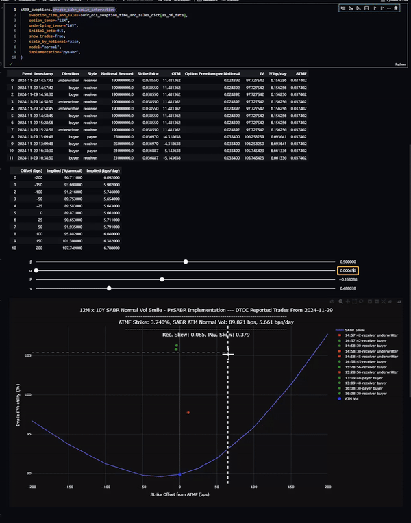

# Curvy-CUSIPs

Using Open Sourced Data for Rates Trading examples in Python:

- Cash Treasuries: [FedInvest EOD Markings](https://www.treasurydirect.gov/GA-FI/FedInvest/selectSecurityPriceDate)
- Swaps/Swaptions: [DTCC SDR](https://pddata.dtcc.com/ppd/cftcdashboard), [BBG SEF](https://data.bloombergsef.com/)
- SOFR OIS Curve: [Eris SOFR Swap Futures FTP](https://files.erisfutures.com/ftp/)
- Economics/Misc: [FRED](https://fred.stlouisfed.org/), [NYFRB](https://markets.newyorkfed.org/static/docs/markets-api.html)

## To get started:

Clone repo:
```
git clone https://github.com/yieldcurvemonkey/Curvy-CUSIPs.git
```

pip install dependencies: 
```
pip install -r requirements.txt
```

cd into scripts dir:
```
cd .\Curvy-CUSIPs\scripts
```

Init Cash Treasuries DBs: 

```
python update_ust_cusips_db.py init
```

- This will take 30-60 minutes
- This will create 6 databases
    - ust_cusip_set
    - ust_cusip_timeseries
    - ust_eod_ct_yields
    - ust_bid_ct_yields
    - ust_mid_ct_yields
    - ust_offer_ct_yields

- Data is source from FedInvest
- Data availability: daily bid, offer, mid prices and ytms at cusip level (and cusip characteristics) starting from late 2008
- Script, by default, fetches data starting from 2018
- See below for examples

Update Cash Treasuries DBs: 

```
python update_ust_cusips_db.py
```

Init SOFR OIS Curve DB:

```
python update_sofr_ois._db.py init
```

- This will take 30-60 minutes
- This will create one database: nyclose_sofr_ois
- Curve marking from < 2024-01-12 is from the BBG 490 Curve, newer EOD markings are sourced from the Eris FTP
- See below for examples

Update SOFR OIS Curve DB:
```
python update_sofr_ois._db.py
```

Init and update ATM Swaption Vol DB:
```
python update_atm_swaption_vol.py
```

Init Swaption Vol Cube DB
```
python update_swaption_vol_cube.py init
```

Update Swaption Vol Cube DB
```
python update_swaption_vol_cube.py
```

## Checkout examples in `\notebooks`:

### [usts_basics.ipynb](https://github.com/yieldcurvemonkey/Curvy-CUSIPs/blob/main/notebooks/usts_basics.ipynb)
- Yield Curve Plotting
- CT Yields Dataframe
- CUSIP look up
- CUSIP plotting
- Spread, Flies plotting

### [swaps_basics.ipynb](https://github.com/yieldcurvemonkey/Curvy-CUSIPs/blob/main/notebooks/swaps_basics.ipynb)
- SOFR OIS Curve Ploting
- SOFR OIS Swap Spreads
- Spread, Flies plotting
- Swap Fwds

### [par_curves.ipynb](https://github.com/yieldcurvemonkey/Curvy-CUSIPs/blob/main/notebooks/par_curves.ipynb)
- Plot your splines/par curve model against all active CUSIPs on a historical date
- Example shown is a textbook par model: filter based on some liquidity premium then fit a cubic spline


### [jpm_rv_example.ipynb](https://github.com/yieldcurvemonkey/Curvy-CUSIPs/blob/main/notebooks/jpm_rv_example.ipynb)
- Thats a pretty good fit given that we are using publicly sourced data!
- The par model in the example is loosely based (same knot points) on JPM's [par curve model](https://github.com/yieldcurvemonkey/Curvy-CUSIPs/blob/main/research/Linear/JPM%20Rates%20Strategy%20The%20(par)%20curves%20they%20are%20a-changin%E2%80%99%20Making%20enhancements%20to%20our%20Treasury%20%26%20TIPS%20par%20curves.%20Tue%20Jul%2023%202024.pdf), so we should expect that our residuals are similar


### [calculating_cash_hedge_ratios.ipynb](https://github.com/yieldcurvemonkey/Curvy-CUSIPs/blob/main/notebooks/calculating_cash_hedge_ratios.ipynb)

For DV01 neutrality, if the DV01s of bonds $\text{Oct 26s}$ and $\text{Aug 34s}$ are $\text{DV01}_\text{Oct 26s}$ and $\text{DV01}_\text{Aug 34s}$, then $n_\text{Oct 26s}$ notional of bond $\text{Oct 26s}$ is hedged with $n_\text{Aug 34s}$ notional of bond $\text{Aug 34s}$ such that,

$$
\frac{n_\text{Oct 26s} \, \text{DV01}_\text{Oct 26s}}{100} + \frac{n_\text{Aug 34s} \, \text{DV01}_\text{Aug 34s}}{100} = 0
$$

$$
n_\text{Aug 34s} = -n_\text{Oct 26s} \frac{\text{DV01}_\text{Oct 26s}}{\text{DV01}_\text{Aug 34s}}
$$

For regression hedging, we simply weight the above by the $\beta$ we found.

$$
\frac{n_{\text{Oct 26s}} \, \text{DV01}_{\text{Oct 26s}}}{100} \, \beta + \frac{n_{\text{Aug 34s}} \, \text{DV01}_{\text{Aug 34s}}}{100} = 0
$$

$$
n_{\text{Aug 34s}} = -n_{\text{Oct 26s}} \frac{\text{DV01}_{\text{Oct 26s}}}{\text{DV01}_{\text{Aug 34s}}} \, \beta
$$

We can also extend the PCA framework for hedging purposes. PCA allows us to view and importantly quantify the driving forces of a trade into uncorrelated factors. This allows us to hedge against specific factors. Say for our `4.125% Oct-26s - 3.875% Aug-34s` steepener, we can simply see how changes in the first (level) factor impact the Oct 26s and Aug 34s and choose the hedge ratios in such a way that both net out. We have now exposure only to higher order PCs.

$$
\frac{n_\text{Aug 34s}}{n_{\text{Oct 26s}}} = \frac{DV01_{\text{Oct 26s}}}{DV01_\text{Aug 34s}} \cdot \frac{e_\text{Oct 26s}^1}{e_\text{Aug 34s}^1}.
$$

$e^1$ is the factor loadings (entries of the eigenvector) for PC1 of the respective bond. Factor loadings indicate how strongly each variable projects onto a principal component i.e. its the cosine of the angle between the variable's vector in the original space and the principal component's vector: a high factor loading means the variable is closely aligned with the principal component, contributing significantly to the variance captured by that component. The ratio 

$$
\frac{e_\text{Oct 26s}^1}{e_\text{Aug 34s}^1}
$$

may look like the beta weighting in regression hedging however this ratio is independent of conditional expectations or the regression framework and it rather represents the relative alignment of the two variables with the direction of the first principal component. Beta measures the conditional expectation of $x_1$ given $x_2$ and thus it is directional, reversing the roles of $x_1$ and $x_2$ results in a different $\beta$.

For fly trades, say we want calculate the notional amounts needed on the wings for a 2s5s10s, we simply solve the below system:

Suppose the PCA loadings for each maturity $i \in \{2Y, 5Y, 10Y\}$ on factor 1 are $e_{i,1}$ and on factor 2 are $e_{i,2}$. Also let $BPV_i$ be the "basis point value" (DV01) for each maturity. To be neutral to factor 1 and factor 2 means:

$$
n_2 \cdot (BPV_2 \cdot e_{2,1}) + n_5 \cdot (BPV_5 \cdot e_{5,1}) + n_{10} \cdot (BPV_{10} \cdot e_{10,1}) = 0
$$

$$
n_2 \cdot (BPV_2 \cdot e_{2,2}) + n_5 \cdot (BPV_5 \cdot e_{5,2}) + n_{10} \cdot (BPV_{10} \cdot e_{10,2}) = 0
$$

Because you typically pick a notional for one leg (here the 5Y, $n_5$), these two equations become a $2 \times 2$ linear system in the unknowns $n_2$ and $n_{10}$.

Rewriting those two neutrality conditions in matrix form:

$$
\begin{pmatrix}
BPV_2 \cdot e_{2,1} & BPV_{10} \cdot e_{10,1} \\
BPV_2 \cdot e_{2,2} & BPV_{10} \cdot e_{10,2}
\end{pmatrix}
\begin{pmatrix}
n_2 \\
n_{10}
\end{pmatrix}
= -n_5 \cdot BPV_5
\begin{pmatrix}
e_{5,1} \\
e_{5,2}
\end{pmatrix}.
$$

Symbolically:

$$
A \cdot 
\begin{pmatrix}
n_2 \\
n_{10}
\end{pmatrix}
= \mathbf{b},
$$
where:
$$
A = \begin{pmatrix}
BPV_2 \cdot e_{2,1} & BPV_{10} \cdot e_{10,1} \\
BPV_2 \cdot e_{2,2} & BPV_{10} \cdot e_{10,2}
\end{pmatrix}, 
\quad 
\mathbf{b} = -n_5 \cdot BPV_5
\begin{pmatrix}
e_{5,1} \\
e_{5,2}
\end{pmatrix}.
$$

Provided $A$ is invertible (which it usually is, assuming non-degenerate factor loadings and DV01s), the solution is simply:

$$
\begin{pmatrix}
n_2 \\
n_{10}
\end{pmatrix}
= A^{-1} \mathbf{b}.
$$

That yields the hedge ratios $n_2$ and $n_{10}$ (for a chosen $n_5$) such that the overall 2y–5y–10y position has zero exposure to the first two principal components.


### [sabr_smile.ipynb](https://github.com/yieldcurvemonkey/Curvy-CUSIPs/blob/main/notebooks/sabr_smile.ipynb)



### More examples/notebooks coming soon
